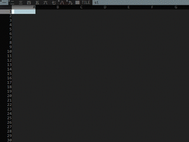

cells
=====

This is a C++ implementation a TUI-based spreadsheet utility.



### Usage

There are no dependencies so simply running `make` should suffice:

```sh
make
./cells
```

For more info see man page:

```sh
man ./cells.1
```
